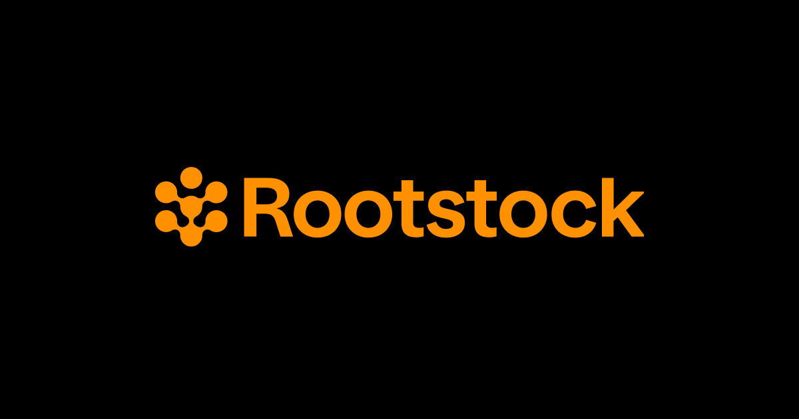

[](https://scorecard.dev/viewer/?uri=github.com/rsksmart/collective-sdk)
[](https://github.com/rsksmart/collective-sdk/actions?query=workflow%3ACodeQL)



# @rsksmart/collective-sdk

SDK for interacting with the Rootstock Collective DAO protocol. This SDK provides a simple interface for backing builders, governance (proposals and voting), staking, and rewards management.

## Installation

```bash
npm install @rsksmart/collective-sdk viem
```

## Quick Start

```typescript
import { CollectiveSDK } from '@rsksmart/collective-sdk'
import { parseEther } from 'viem'

// Initialize SDK
const sdk = new CollectiveSDK({ chainId: 31 }) // 31 = testnet, 30 = mainnet

// Get user balances
const balances = await sdk.holdings.getBalances('0x...')
console.log('RIF Balance:', balances.rif.formatted)
console.log('stRIF Balance:', balances.stRif.formatted)

// Get builders list
const builders = await sdk.backing.getBuilders()
console.log('Active builders:', builders.filter(b => b.isOperational).length)

// Get proposals
const { proposals } = await sdk.proposals.getProposals({ limit: 10 })
console.log('Latest proposals:', proposals.length)
```

## Features

- **Backing**: View and manage builder backing allocations
- **Holdings**: Check token balances (RIF, stRIF, USDRIF, RBTC) and voting power
- **Staking**: Stake RIF to receive stRIF and manage staking positions
- **Rewards**: View and claim backer rewards
- **Governance**: View proposals, vote, and create new proposals

## API Reference

### Initialization

```typescript
const sdk = new CollectiveSDK({
  chainId: 31,                    // Required: 30 (mainnet) or 31 (testnet)
  rpcUrl?: string,                // Optional: Custom RPC URL
  contractAddresses?: Partial<ContractAddresses>, // Optional: Override addresses
})
```

---

## Backing Module (`sdk.backing`)

### `getAvailableForBacking(backerAddress)`

Get available stRIF balance for backing builders.

```typescript
const available = await sdk.backing.getAvailableForBacking('0x...')

// Returns:
{
  balance: TokenAmount,       // Total stRIF balance
  totalAllocated: TokenAmount,// Already allocated to builders
  available: TokenAmount      // Available for new backing
}
```

### `getTotalBacking(backerAddress)`

Get total backing amount for a user.

```typescript
const backing = await sdk.backing.getTotalBacking('0x...')

// Returns:
{
  amount: TokenAmount,   // Total allocated amount
  buildersCount: number  // Number of backed builders
}
```

### `getBackersIncentives()`

Get global backers incentives statistics.

```typescript
const incentives = await sdk.backing.getBackersIncentives()

// Returns:
{
  annualPercentage: Percentage,    // Estimated annual percentage
  rewardsRif: TokenAmount,         // Current cycle RIF rewards
  rewardsNative: TokenAmount,      // Current cycle RBTC rewards
  rewardsUsdrif: TokenAmount,      // Current cycle USDRIF rewards
  totalPotentialReward: TokenAmount
}
```

### `getBuilders()`

Get list of all builders in the protocol.

```typescript
const builders = await sdk.backing.getBuilders()

// Each builder:
{
  address: Address,      // Builder wallet address
  gauge: Address,        // Builder's gauge contract
  isOperational: boolean,// Active and not paused
  totalAllocation: bigint,
  stateFlags: {
    initialized: boolean,
    kycApproved: boolean,
    communityApproved: boolean,
    kycPaused: boolean,
    selfPaused: boolean
  }
}
```

### `getBackedBuilders(backerAddress)`

Get builders that a user is backing with their allocations.

```typescript
const { backedBuilders, totalBacking } = await sdk.backing.getBackedBuilders('0x...')

// Each backed builder:
{
  builder: Builder,
  allocation: TokenAmount  // Amount allocated to this builder
}
```

---

## Holdings Module (`sdk.holdings`)

### `getBalances(userAddress)`

Get token balances for a user.

```typescript
const balances = await sdk.holdings.getBalances('0x...')

// Returns:
{
  rif: TokenAmount,     // RIF balance
  stRif: TokenAmount,   // stRIF balance
  usdrif: TokenAmount,  // USDRIF balance
  rbtc: TokenAmount     // Native RBTC balance
}
```

### `getVotingPower(userAddress)`

Get voting power (stRIF balance) for governance.

```typescript
const power = await sdk.holdings.getVotingPower('0x...')

// Returns:
{
  votingPower: TokenAmount,
  delegatedTo: Address | null
}
```

### `getUnclaimedRewards(backerAddress)`

Get aggregated unclaimed rewards for a backer.

```typescript
const rewards = await sdk.holdings.getUnclaimedRewards('0x...')

// Returns:
{
  rif: TokenAmount,
  rbtc: TokenAmount,
  usdrif: TokenAmount,
  totalUsdValue: number  // Estimated USD value
}
```

### `getDetailedRewardsList(backerAddress)`

Get detailed breakdown of rewards per gauge and token.

```typescript
const detailed = await sdk.holdings.getDetailedRewardsList('0x...')

// Returns rewards grouped by gauge with per-token amounts
```

### `claimRewards(walletClient, backerAddress, token?)`

Claim backer rewards.

```typescript
// Claim all rewards
const result = await sdk.holdings.claimRewards(walletClient, '0x...', 'all')

// Claim specific token
const result = await sdk.holdings.claimRewards(walletClient, '0x...', 'rif')
// Options: 'rif', 'rbtc', 'usdrif', 'all'

// Wait for confirmation
const receipt = await result.wait(1)
console.log('Claimed in block:', receipt.blockNumber)
```

---

## Staking Module (`sdk.staking`)

### `getStakingInfo(userAddress)`

Get staking information for a user.

```typescript
const info = await sdk.staking.getStakingInfo('0x...')

// Returns:
{
  rifBalance: TokenAmount,   // RIF balance
  stRifBalance: TokenAmount, // stRIF balance
  allowance: TokenAmount,    // RIF allowance for staking
  hasAllowance: (amount: bigint) => boolean
}
```

### `approveRIF(walletClient, amount)`

Approve RIF tokens for staking.

```typescript
const tx = await sdk.staking.approveRIF(walletClient, parseEther('100'))
console.log('Approval tx:', tx.hash)
await tx.wait(1)
```

### `stakeRIF(walletClient, amount, delegatee)`

Stake RIF to receive stRIF.

```typescript
// First approve
await sdk.staking.approveRIF(walletClient, parseEther('100'))

// Then stake (delegate voting power to yourself)
const tx = await sdk.staking.stakeRIF(
  walletClient,
  parseEther('100'),
  '0x...' // delegatee address (usually your own)
)
await tx.wait(1)
```

### `unstakeRIF(walletClient, amount, recipient)`

Unstake stRIF to receive RIF back.

```typescript
const tx = await sdk.staking.unstakeRIF(
  walletClient,
  parseEther('50'),
  '0x...' // recipient address
)
await tx.wait(1)
```

---

## Proposals Module (`sdk.proposals`)

### `getStats()`

Get Governor contract statistics.

```typescript
const stats = await sdk.proposals.getStats()

// Returns:
{
  proposalCount: number,
  proposalThreshold: TokenAmount,  // Minimum stRIF to create proposal
  quorumVotes: TokenAmount,        // Minimum votes for quorum
  votingDelay: number,             // Blocks before voting starts
  votingPeriod: number             // Voting duration in blocks
}
```

### `getProposals(options?)`

Get paginated list of proposals.

```typescript
const { proposals, total, hasMore } = await sdk.proposals.getProposals({
  offset: 0,
  limit: 10
})

// Each proposal:
{
  id: string,
  proposer: Address,
  state: ProposalState,
  stateLabel: string,
  votes: {
    forVotes: TokenAmount,
    againstVotes: TokenAmount,
    abstainVotes: TokenAmount
  },
  startBlock: bigint,
  endBlock: bigint
}
```

### `getProposal(proposalId)`

Get basic proposal information (fast).

```typescript
const proposal = await sdk.proposals.getProposal('123456...')
```

### `getProposalDetails(proposalId, options?)`

Get full proposal details including description and actions.

```typescript
const proposal = await sdk.proposals.getProposalDetails('123456...', {
  fromBlock: 1000000n // Optional: start block for event search
})

// Includes:
{
  ...basicInfo,
  description: string,
  actions: ProposalAction[]
}
```

### `castVote(walletClient, proposalId, support, options?)`

Cast a vote on a proposal.

```typescript
import { VoteSupport } from '@rsksmart/collective-sdk'

const result = await sdk.proposals.castVote(
  walletClient,
  '123456...',
  VoteSupport.For,  // For, Against, or Abstain
  { reason: 'Great proposal!' }
)
await result.wait(1)
```

### `hasVoted(proposalId, voterAddress)`

Check if user has already voted.

```typescript
const voted = await sdk.proposals.hasVoted('123456...', '0x...')
```

### `canCreateProposal(userAddress)`

Check if user has enough voting power to create proposals.

```typescript
const { canCreate, votingPower, threshold } = await sdk.proposals.canCreateProposal('0x...')
```

### `createTreasuryTransferProposal(walletClient, options)`

Create a treasury transfer proposal.

```typescript
const tx = await sdk.proposals.createTreasuryTransferProposal(walletClient, {
  token: 'rif',           // 'rif', 'rbtc', or 'usdrif'
  recipient: '0x...',
  amount: parseEther('1000'),
  description: 'Fund development team'
})
```

### `createBuilderWhitelistProposal(walletClient, options)`

Create a proposal to whitelist a new builder.

```typescript
const tx = await sdk.proposals.createBuilderWhitelistProposal(walletClient, {
  builderAddress: '0x...',
  description: 'Whitelist Builder XYZ'
})
```

---

## Full Example

```typescript
import { CollectiveSDK, VoteSupport } from '@rsksmart/collective-sdk'
import { createWalletClient, createPublicClient, http, parseEther } from 'viem'
import { privateKeyToAccount } from 'viem/accounts'
import { rootstockTestnet } from 'viem/chains'

async function main() {
  // Initialize SDK
  const sdk = new CollectiveSDK({ chainId: 31 })

  // Setup wallet
  const account = privateKeyToAccount('0x...')
  const walletClient = createWalletClient({
    account,
    chain: rootstockTestnet,
    transport: http(),
  })
  const publicClient = createPublicClient({
    chain: rootstockTestnet,
    transport: http(),
  })

  // Check balances
  const balances = await sdk.holdings.getBalances(account.address)
  console.log('RIF:', balances.rif.formatted)
  console.log('stRIF:', balances.stRif.formatted)

  // Stake RIF
  const stakeAmount = parseEther('100')
  const stakingInfo = await sdk.staking.getStakingInfo(account.address)
  
  if (!stakingInfo.hasAllowance(stakeAmount)) {
    console.log('Approving RIF...')
    const approveTx = await sdk.staking.approveRIF(walletClient, stakeAmount)
    await approveTx.wait(1)
  }

  console.log('Staking RIF...')
  const stakeTx = await sdk.staking.stakeRIF(walletClient, stakeAmount, account.address)
  await stakeTx.wait(1)
  console.log('Staked!')

  // View proposals
  const { proposals } = await sdk.proposals.getProposals({ limit: 5 })
  console.log('Recent proposals:', proposals.length)

  // Vote on a proposal
  const activeProposal = proposals.find(p => p.stateLabel === 'Active')
  if (activeProposal) {
    const hasVoted = await sdk.proposals.hasVoted(activeProposal.id, account.address)
    if (!hasVoted) {
      console.log('Voting...')
      const voteTx = await sdk.proposals.castVote(
        walletClient,
        activeProposal.id,
        VoteSupport.For
      )
      await voteTx.wait(1)
      console.log('Voted!')
    }
  }

  // Check and claim rewards
  const rewards = await sdk.holdings.getUnclaimedRewards(account.address)
  if (rewards.rif.value > 0n || rewards.rbtc.value > 0n) {
    console.log('Claiming rewards...')
    const claimTx = await sdk.holdings.claimRewards(walletClient, account.address, 'all')
    await claimTx.wait(1)
    console.log('Rewards claimed!')
  }
}

main().catch(console.error)
```

## Supported Networks

| Network | Chain ID | Status |
|---------|----------|--------|
| Rootstock Mainnet | 30 | ✅ Available |
| Rootstock Testnet | 31 | ✅ Available |

## Types

The SDK exports all TypeScript types:

```typescript
import type {
  CollectiveConfig,
  TokenBalances,
  VotingPower,
  StakingInfo,
  Builder,
  BackersIncentives,
  Proposal,
  ProposalState,
  VoteSupport,
  // ... and more
} from '@rsksmart/collective-sdk'
```

## Enums

```typescript
import { ProposalState, VoteSupport } from '@rsksmart/collective-sdk'

// Proposal states
ProposalState.Pending
ProposalState.Active
ProposalState.Canceled
ProposalState.Defeated
ProposalState.Succeeded
ProposalState.Queued
ProposalState.Expired
ProposalState.Executed

// Vote options
VoteSupport.Against  // 0
VoteSupport.For      // 1
VoteSupport.Abstain  // 2
```


## Contributing

We welcome contributions from the community. Please fork the repository and submit pull requests with your changes. Ensure your code adheres to the project's main objective.

## Support

For any questions or support, please open an issue on the repository or reach out to the maintainers.

## Disclaimer

The software provided in this GitHub repository is offered "as is," without warranty of any kind, express or implied, including but not limited to the warranties of merchantability, fitness for a particular purpose, and non-infringement.

- **Testing:** The software has not undergone testing of any kind, and its functionality, accuracy, reliability, and suitability for any purpose are not guaranteed.
- **Use at Your Own Risk:** The user assumes all risks associated with the use of this software. The author(s) of this software shall not be held liable for any damages, including but not limited to direct, indirect, incidental, special, consequential, or punitive damages arising out of the use of or inability to use this software, even if advised of the possibility of such damages.
- **No Liability:** The author(s) of this software are not liable for any loss or damage, including without limitation, any loss of profits, business interruption, loss of information or data, or other pecuniary loss arising out of the use of or inability to use this software.
- **Sole Responsibility:** The user acknowledges that they are solely responsible for the outcome of the use of this software, including any decisions made or actions taken based on the software's output or functionality.
- **No Endorsement:** Mention of any specific product, service, or organization does not constitute or imply endorsement by the author(s) of this software.
- **Modification and Distribution:** This software may be modified and distributed under the terms of the license provided with the software. By modifying or distributing this software, you agree to be bound by the terms of the license.
- **Assumption of Risk:** By using this software, the user acknowledges and agrees that they have read, understood, and accepted the terms of this disclaimer and assumes all risks associated with the use of this software.
